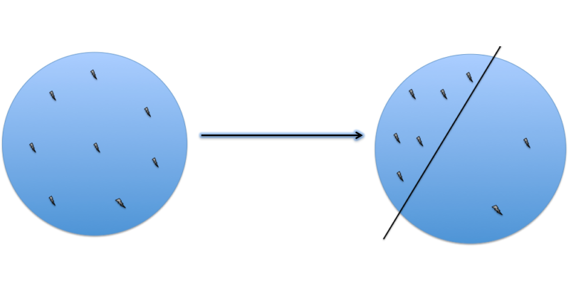

coR-ge | Investigation of sFDR in Environments of Complex Correlation
========================================================
author: Christopher Cole
date: July 24th 2015
transition: rotate

Genome Wide Association Studies
========================================================

- Agnostic search of the genome for significant associations
- Hypothesis free
- Many finding, but huge missing heritability
- Moving towards hypothesis driven GWAS (GWAS-HD)
  - Single SNP association with re-prioritization based on biological hypothesis
  - Stratified FDR

Missing Heritability
========

Maher B (Nature, 2008)

1. **Right under everyone's nose** - better tagging (Imputation and sequencing)
2. **Out of sight** - Rare variants
3. **In the architecture** - CNVs
4. **Underground networks** - Systems Biology
5. **The great beyond** - Epigenetics
6. **Lost in diagnosis** - Phenotype Definition

Statistical Challeneges and Opportunities
========
- SNP genotype calling algorithms
- Imputation
- Single vs. multi SNP / trait analysis
- Sample heterogeneity and population stratification
- Meta versus mega analysis
- Family data

>- **Assesing statistical significance of findings**

- *et cetera*

Multiple Testing Correction Primer
=====

> **Theorum 1**: If $H_0$ is true, $P(\phi \leq |\phi_{\alpha}|) = 1-\alpha$
 - i.e. if "significant" $P$-value is $0.05$, given $H_0$, chance of correcting failing to reject the null is $0.95$

> **Theorum 2**: Given $A$ and $B$ are independent, $P(A \cup B) = P(A) \times P(B)$
 - i.e. probability of two events occuring together is the product of their individual probabilities (assuming independence)

Multiple Testing Correction Primer
=======

 Probability of *at least 1* false positive = $1-(1-\alpha)^M$ given $M$ independant tests at $\alpha$ rejection level

- For 3 tests, probability of at least one false positive
 - $1-(1-0.05)^3 = 0.1426$
- For 10 tests $= 0.40$
- As $M \rightarrow \infty$, $P(FP>1) \rightarrow 1$

Correction Methods
=======

- As $M$ increases, expect more false positives under the null
- **Family Wise Error Rate**:
 - Control for the probability of *even one* false positive $\leq \alpha$
 - $\alpha_{control} = 1-(1-\alpha)^{\frac{1}{M}} \sim \frac{\alpha}{M}$
- **False Disovery Rate**:
 - Allow some false positives but control the proportion | $E[\frac{V}{R}] \leq \alpha$ given $V$ false positves and $R$ total positive signals.
 - **A comprimise**: no-adjustment (too liberal) $\leftrightarrow$ FWER (too stringent)

Stratefied FDR
=====
- Lei Sun, 2006
- "Priority Group"
- Lots of questions
 - Effect of genome-like complex correlation

Introducing coR-ge
=====

- Software for the Examination of Multiple Correction Methodologies in Accurate Genomic Environments
- Permutation testing of correction methodologies in different settings

Introducing coR-ge
=====

- ~ 5k lines `R`, python, `Sh`
- Released under GPL
- Requires
 - Cluster
 - Reference Data
 - Causal SNPs
 - etc.

Disease Model
=====

- Heritability
 - 0.45
- Variability
 - 0.55
- Disease SNPs or loci
- Region of the genome
 - Chromosome 1
- Reference Panel
 - CEU 1000G

Resampling
=====

- **HapGen2**
 - Take haplotypes from reference panel
 - Estimate fine-scale recombination rate

Phenotype Generation
===========
- Effect size for each $i$ of $N$ SNPs $\beta = \delta\sqrt{\frac{\theta^2_i}{2p(1-p)}}$
 - $\beta$ effect size in s.d., $\theta^2_i$ variance, $p = MAF$, $\delta = \pm 1$
- Risk score $WAS = \sum_{i=1}^{N} \beta_i SNP_i -2\beta_i p_i$
 - $i$ of $N$ SNPs, $\beta$ E.S., $p=MAF$
- Overall $z$-score $= WAS + N(0,1-h^2)$
 - $WAS$ weighted allele score, Gaussian noise $\mu = 0$, $\theta^2 = 1-heritability$

Analysis
========

- Standard GWAS with `plink`, data manipulation in `gtool` and R
- Algorithmic analysis of each permutation
- Reports $TP_m$, $FP_m$, $TN_m$, and $FN_m$ given $m$ methodology
- Permuted to establish trends
 - $n = 100$

Randomly Selected Loci
========

<iframe height="600" id="igraph" scrolling="no" seamless="seamless"
				src="https://plot.ly/~Chris1221/20" width="600" frameBorder="0"></iframe>

